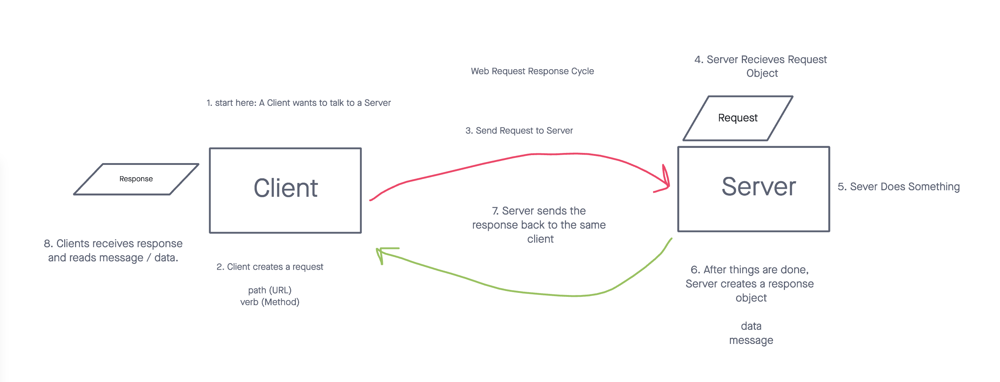

# Class 03 - Passing Functions as Props

## Warm Up

## Code Review

Array.map challenges
- takes in 2 parameters (element and index)

```javascript
let names = ['Jacob', "Cameron'];

names.map(function(element, index) {

});

```

Adding favorites count to each Horned Beast

Thanks Mandy :)!!

### Array.filter

Filters an existing array, creating a new one with certain element filtered out.

```javascript

// [1,2,3,4,5,6] => [1,3,5];
let numbers = [1,2,3,4,5,6];

numbers.forEach((element) => {}); // read values
numbers.map((element) => {}); // reading and creating a new array
let oddNumbers = numbers.filter((element) => {
  // return a boolean
  return (element % 2); // divide by (x) and return the remainder
}); // reading and creating a new array of filter elements

oddNumbers; // [1,3,5

// filter to new array of only TAs
let people = [
  { name: 'jacob', role: 'INSTRUCTOR'},
  { name: 'Adrian', role: 'TA'},
  { name: 'Cameron', role: 'TA' }
];

let tas = people.filter(x => x.role == "TA"); 

```

## WRRC (Web Request Response Cycle)

Is the process of computers having a conversation over the internet.



## Lap Prep: Functions as Props

If a Parent Component gives the ability to update it's state to a child, we need to be careful.

- Managing State is always the job of the component where state lives, any function passed to a child should be able to mutate state in a way that doesn't break our UI.